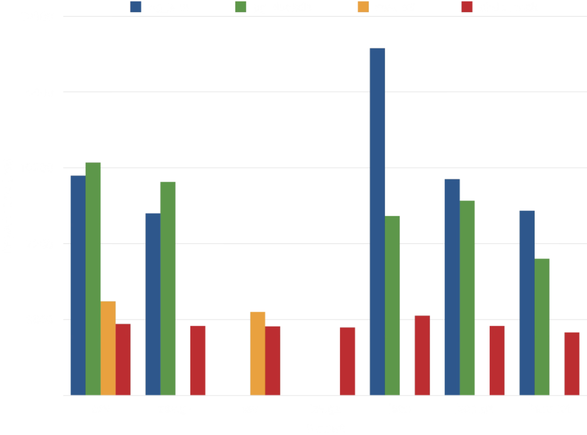
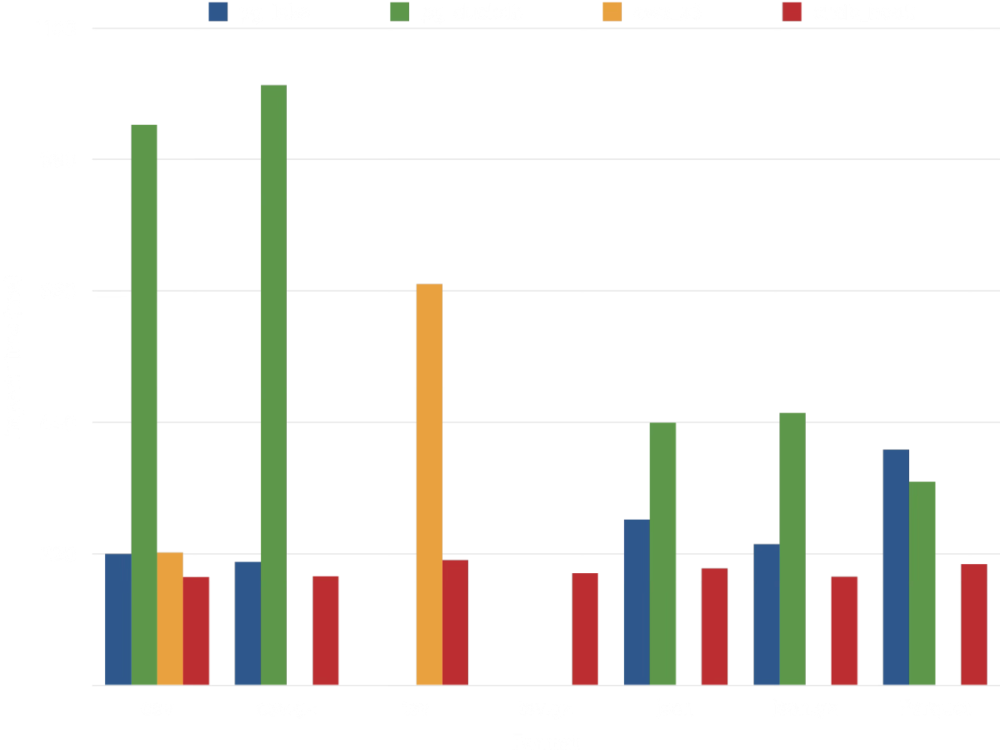
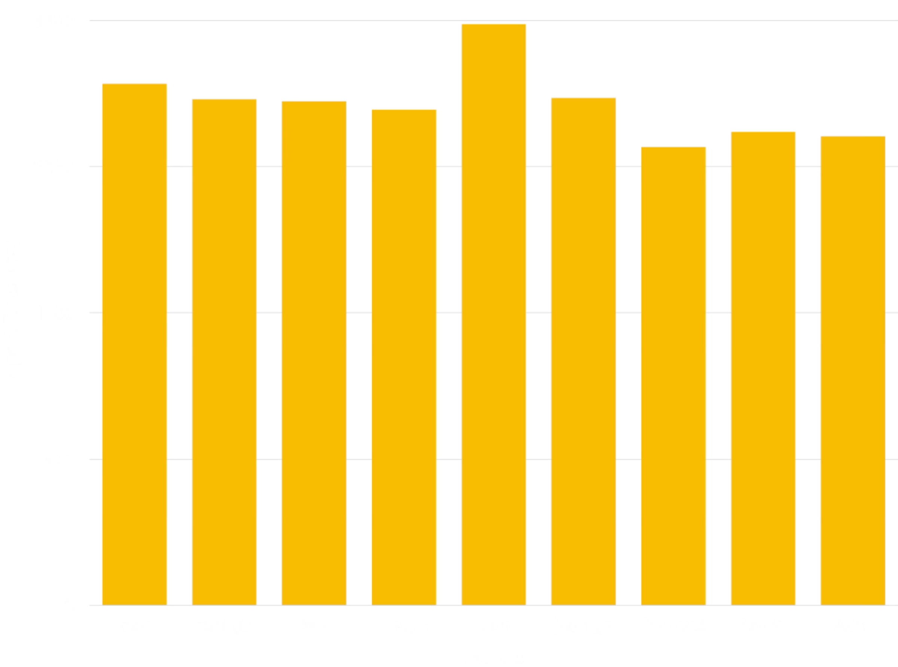

Postgres Lake Copy Benchmark
============================

Create data sets in various formats and test importing that data from S3 with
various extensions.

The benchmark scripts for each extension execute in a PL/pgSQL function to
minimize overhead timing, except for pg_duckdb, which cannot run inside a
function. Each establishes an overhead cost, executes each query three times
and subtracts the overhead from each run, then summarizes the output.

## Charts

Test configurations:

*   chdb 0.1.1, PG 18, r8id.xlarge, 4 vCPUs and 32 GB RAM
*   pg_lake 3.5, PG 18, r8id.xlarge, 4 vCPUs and 32 GB RAM
*   pg_duckdb 1.2.0 (ee38d3b), PG 18, r8id.xlarge, 4 vCPUs and 32 GB RAM
*   aws_s3 1.2.0, PG 18, db.r8g.xlarge, 4 vCPUs and 32 GB RAM

### NYC Taxi Data



### "Logs" Data



### chdb Data Formats



## Data Sets

```sh
make corpus
```

Generates the benchmark data sets in the `amazon`, `hacknernews`, `logs`, and
`taxi_trips` directories.

## Upload

```sh
export AWS_ACCESS_KEY_ID="xxxxxxxxxxxxxxxxx"
export AWS_SECRET_ACCESS_KEY="xxxxxxxxxxxxxxxxxxxxxxxxxxxxxxxxxx"
export AWS_SESSION_TOKEN="xxxxxxxxxxxxxxxxxxxxxxxxxxxxxxxxxxxxxxxxxxxxxxxxxxxxxxxxxxxxxxxxxxxxxxxxxxxxxxxxxxxxx"
make sync-s3
```

Syncs the data sets to the `chdb-lakedata-public` S3 bucket. Requires the
`aws` CLI.

## Benchmark

```sh
export PGHOST=chdb_host PGUSER=chdb_user PGPASSWORD=chdb_password
make chdb/results.tsv

export PGHOST=aws_s3_host PGUSER=aws_s3_user PGPASSWORD=aws_s3_password
make aws_s3/results.tsv

export PGHOST=pg_duckdb_host PGUSER=pg_duckdb_user PGPASSWORD=pg_duckdb_password
make pg_duckdb/results.tsv

export PGHOST=pg_lake_host PGUSER=pg_lake_user PGPASSWORD=pg_lake_password
make pg_lake/results.tsv

make results.txt
```

Run each of the tests with any Postgres-specific environment configuration for
each, then collect them all into `results.txt`.

### Summarize

```sh
make summary
```

Summarizes the results by extension, with average runtimes for each data set
and format. Paste into a spreadsheet to generate charts and graphs.

## TOC

*   `Makefile`: Execute tasks
*   `amazon.sql`: Generate Amazon Reviews dataset in `amazon` directory
*   `aws_s3/`: Scripts to test data import with [aws_s3]
*   `chdb/`: Scripts to test data import with [chdb_hook]
*   `export-hacknernews.sql`:  Export Hacknernews dataset from ClickHouse
*   `hackernews.sql`: Generate Hacknernews dataset in `hacknernews` directory
*   `logs.sql`: Generate faux logs output in `logs` directory
*   `mk-datasets.sh`: Generates all datasets
*   `pg_duckdb/`: Scripts to test data import with [pg_duckdb]
*   `pg_lake/`:  Scripts to test data import with [pg_lake]
*   `results.sql`: Reformat results into table for graph generation
*   `taxi_trips.sql`: Generate NYC Taxi dataset in `taxi_trips` directory

  [chdb_hook]: https://pgxn.org/dist/chdb/doc/chdb_hook.html
  [aws_s3]: https://docs.aws.amazon.com/AmazonRDS/latest/UserGuide/USER_PostgreSQL.S3Import.html
  [pg_duckdb]: https://github.com/duckdb/pg_duckdb
  [pg_lake]: https://github.com/Snowflake-Labs/pg_lake
